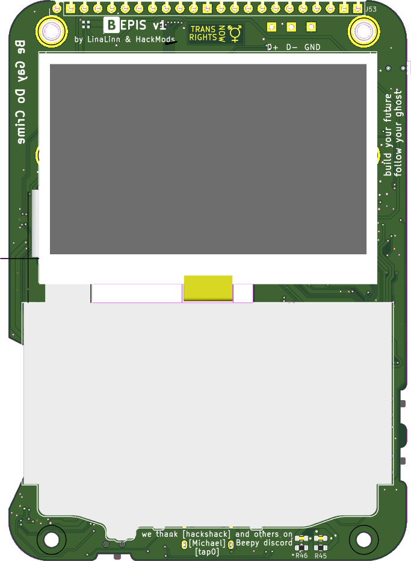

# [Beepis](beepis.md) by HackMods

## Overview

--8<-- "beepis.md"

## Description

Beepis is being designed and created by HackMods, a hacker collective specialized in hardware. It is based on the original [Beepy by SQFMI](../inactive-projects/beepy.md) hardware with "a ton of new features, much-needed bugfixes, and a heap of small improvements". The HackMods team is releasing all their work as open source—hardware, firmware and software—thereby maintaining the open source philosophy of the original Beepy device and its [BBQ20KBD predecessor](../inactive-projects/bbq20kbd.md).

If you're looking to buy an out-of-the-box handheld computer, you'll have to wait... or order [a different device](index.md). At the start of 2025, Beepis are still being prototyped and developed. If you want to keep up with the progress, discussions are active in the original Beepy Discord server: 

In December 2024, HackMods produced their first run of prototype boards and [announced them on Discord](https://discord.com/channels/1108020055318462606/1108020058619400194/1316539999289610331). Each of these v1 PCBs has its components hand-soldered and assembled onto the board by members of HackMods. The team made seven PCBs available for pre-order to the community (now long gone). Each pre-order contained an assembled Beepis motherboard ("no soldering required") without additional components: recipients need to bring their own battery, display, Q20 keyboard and Raspberry Pi Zero to complete their pocket-sized computer.

  <figure markdown="span">
    { width="300" loading=lazy }
    <figcaption>Beepis v1 PCB, front</figcaption>
  </figure>

  <figure markdown="span">
    { width="300" loading=lazy }
    <figcaption>Beepis v1 PCB, back</figcaption>
  </figure>

