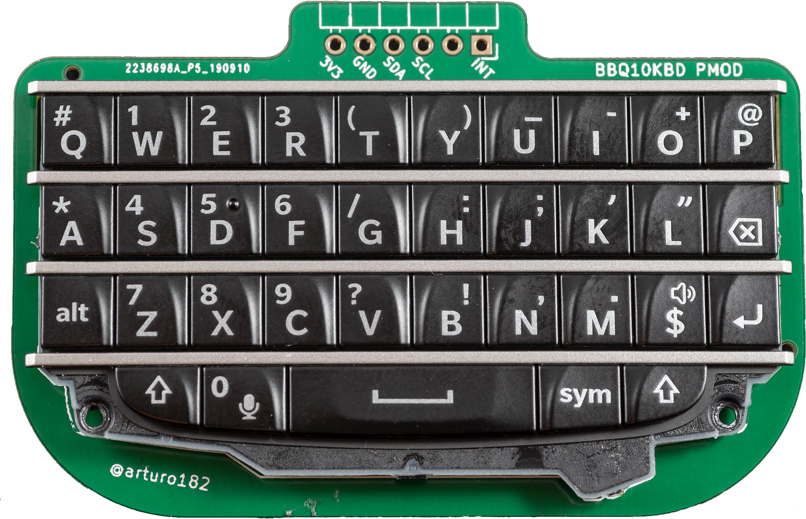

# [BBQ20KBD](bbq20kbd.md) by Solder Party

## Overview

--8<-- "bbq20kbd.md"

## History

In the evolutionary tree of devices based on BB keyboards, the BBQ20KBD is rightfully the *common ancestor* to all of the devices listed on this website. It was the first widely-available device to turn an old BB keyboard into a generic USB device—converting a high-quality mobile QWERTY keypad into a universal keyboard. That universality, along with the choice to make the hardware and software open source, proved to be an irresistable foundation for makers and hackers developing new creations.

But every species has ancestors, and the BBQ20KBD is no exception. The [first documented work](https://perma.cc/XJ9G-X645) reverse engineering a BlackBerry keyboard was posted online in August 2015 on the EEVblog Electronics Community forum. JoeN successfully created a breakout adapter for the Q10 keyboard's cable, with input from the forum community. After reverse engineering the key map, he created a functional demo with the Q10 keyboard mounted on a breadboard and was able to type letters to a screen. Once completed, JoeN posted a [summary of his work](https://forum.arduino.cc/t/interfacing-blackberry-q10-keypad-to-arduino-and-the-oled-typewriter/342989) to the Arduino forum.

<figure markdown="span">
    { width="600" }
    <figcaption>October 2015: JoeN's reverse engineered Q10</figcaption>
</figure>

WooDWorkeR was next to take on the reverse engineering task, documenting his work in a [hackaday.io project](https://perma.cc/X9ZT-E2RW) from September 2017 to March 2018. He successfully reverse engineered the Q10 backlight for the first time. With the newly documented backlight and JoeN's documented key map, WooDWorkeR wrote a controller for the Q10 keyboard using the Arduino Programming Language and ran it on an Arduino Nano, posting the source code in his hackaday.io project and Github . He also posted a [video of his soldering process](https://youtu.be/wIbp7zxpuNc) on YouTube.

Arturo at Solder Party began his own disassembly of the Q10 in December 2017, [inspired by WooDWorkeR's efforts](https://perma.cc/N3BR-LJA5). He discovered and documented a microphone inside the keyboard, and posted a [full pinout with KiCad resources and models](https://github.com/arturo182/bbq10kbd) on Github .

  

  We've now reached the *direct ancestor* of the BBQ20KBD: the [BB Q10 Keyboard PMOD](https://www.solder.party/docs/keyboard-pmod/). In late 2018, with the Q10's hardware now well-documented, Arturo at Solder Party designed this board as an off-the-shelf component for others add a keyboard to their own electronics projects. Starting in [February 2020](https://perma.cc/3R36-GVQG), Solder Party produced and sold the boards [on Tindie](https://perma.cc/75QJ-V83K) (now discontinued). The accompanying documentation is extensive and open source, with open hardware  and I2C firmware . Arturo also published code for using the keyboard with CircuitPython , with Arduino  and as a kernel module for a RaspberryPi .

  

  <figure markdown="span">
    { width="300" loading=lazy }
    <figcaption>BB Q10 Keyboard PMOD by Solder Party</figcaption>
  </figure>

With the Q10 PMOD board, all the ingredients were in place for widespread use of the Q10 keyboard in hobbyist projects. But it was the May 2022 release of the [BBQ20KBD](https://www.solder.party/docs/bbq20kbd/) keyboard by Solder Party that sparked an *evolutionary explosion* of devices based on BB keyboards. The BBQ20KBD is an iteration on the Q10 keyboard. It switched to a Q20 keyboard, which added four function keys and an optical trackpad. It maintained compatibility with the same I2C interface as the Q10 board. And it met the same high standard of open hardware and open source software set by the Q10 PMOD board.

  

  
  But most consequential change was arguably the BBQ20KBD's USB-C port, and the fact that it is recognized as a **generic USB HID keyboard and mouse** when plugged into any computer or smartphone. Now anyone could use and experiment with a high-quality pocket-sized QWERTY keyboard—no programming required. The ensuing attention and enthusiasm led to many new devices incorporating the BBQ20KBD's hardware and software. This tiny USB keyboard captured peoples' imagination.
  
  

  <figure markdown="span">
    { width="300" loading=lazy }
    <figcaption>BBQ20KBD Connections</figcaption>
  </figure>

