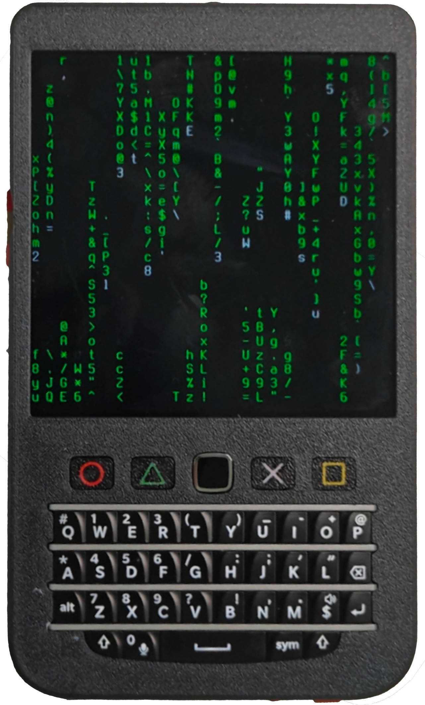
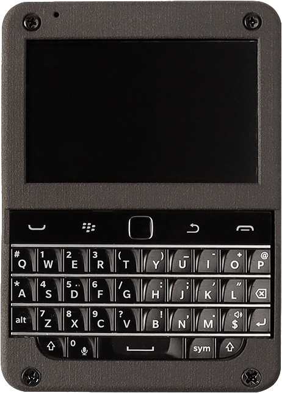
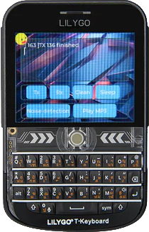
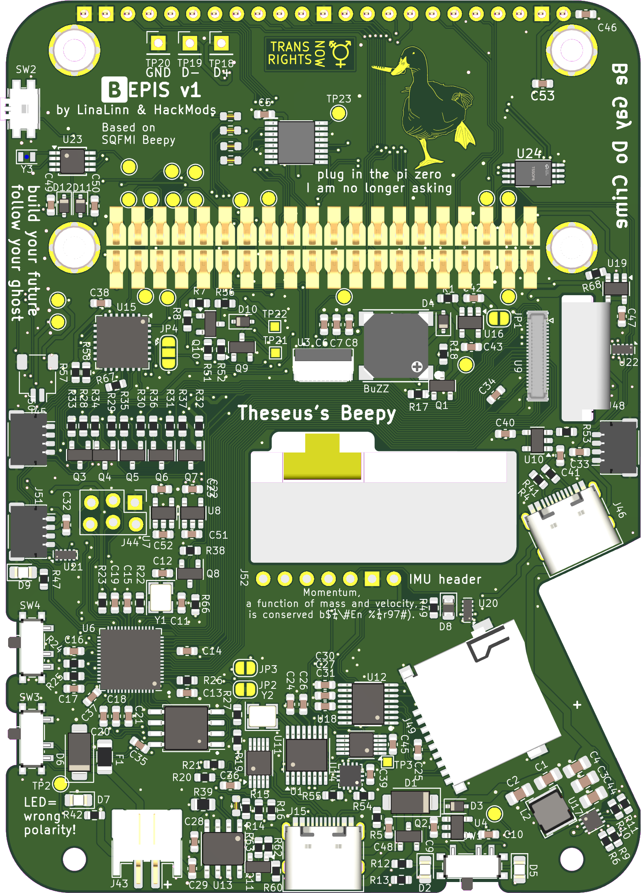
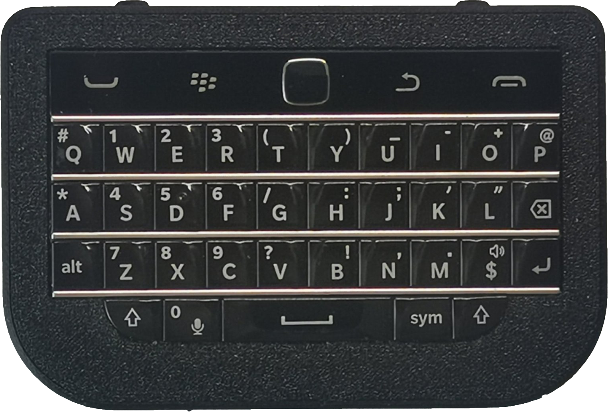
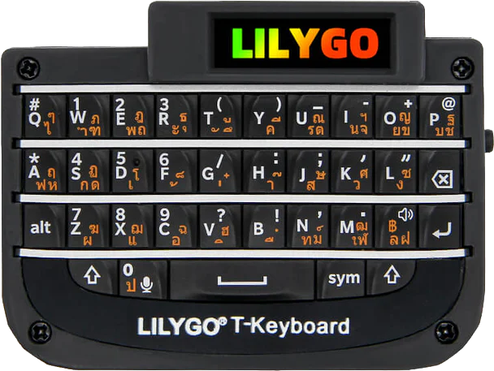

# Gallery

**Computers**

<ul>

  <a href="computers/hackberrypi/" class="grid">
    <li class="card">
      <figure markdown="span">
        
        <figcaption style="margin-bottom: 0;">HackberryPi by Zitao</figcaption>
      </figure>
    </li>
  </a>

  <a href="computers/colorberry/" class="grid">
    <li class="card">
      <figure markdown="span">
        
        <figcaption style="margin-bottom: 0;">ColorBerry by Alex</figcaption>
      </figure>
    </li>
  </a>

  <a href="computers/t-deck/" class="grid">
    <li class="card">
      <figure markdown="span">
        
        <figcaption style="margin-bottom: 0;">T-Deck by LILYGO</figcaption>
      </figure>
    </li>
  </a>

  <a href="computers/beepis/" class="grid">
    <li class="card">
      <figure markdown="span">
        
        <figcaption style="margin-bottom: 0;">Beepis by HackMods</figcaption>
      </figure>
    </li>
  </a>

</ul>

**Keyboards**

<ul>

  <a href="keyboards/bb_keyboards_zitao/" class="grid">
    <li class="card">
      <figure markdown="span">
        
        <figcaption style="margin-bottom: 0;">BB Keyboards by Zitao</figcaption>
      </figure>
    </li>
  </a>

  <a href="keyboards/t-keyboard/" class="grid">
    <li class="card">
      <figure markdown="span">
        
        <figcaption style="margin-bottom: 0;">T-Keyboard by LILYGO</figcaption>
      </figure>
    </li>
  </a>

</ul>

# Introduction

In May 2022, [Solder Party](https://www.solder.party/) released the [BBQ20KBD](inactive-projects/bbq20kbd.md): a handheld USB keyboard created using leftover stock of Q20 keyboards, originally manufactured [from 2014 to 2016](https://en.wikipedia.org/wiki/BlackBerry_Classic). Solder Party developed the circuit board and firmware to convert these mobile QWERTY keyboards into a generic USB device, and released their work as [open hardware](https://github.com/solderparty/bbq20kbd_hw) and [open source software](https://github.com/solderparty/i2c_puppet). Their small production run has long since [sold out](https://lectronz.com/products/bb-q20-keyboard-with-trackpad-usb-i2c-pmod).

Since then, a growing community of enthusiasts have built upon Solder Party's open-sourced work to create a variety of pocket-sized keyboards and computers. Some have added Bluetooth to create a pocket-sized wireless keyboard. Some have added a Raspberry Pi and a screen to create a Gameboy-sized computer. Some have added LoRa to create an off-grid communicator. And some ideas are still being imagined and prototyped—yet to be turned into a physical device.

<figure markdown="span">
    { width="300" }
    <figcaption>BBQ20KBD by Solder Party</figcaption>
</figure>

This website is dedicated to those devices, which have turned leftover inventory of high-quality mobile QWERTY keyboards into new creations. It is a gallery of these creative projects, as well as a resource to existing and prospective users of these devices.

The maintainers of this website have no commercial affiliation with the people creating or selling these devices. We're just members of the community. And since you're here, you might be a member of the BBKB Community too.
